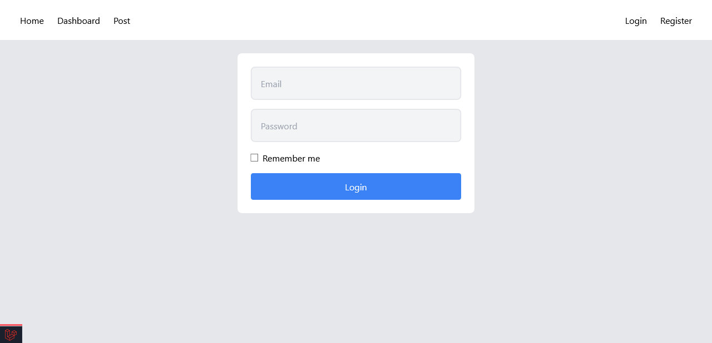
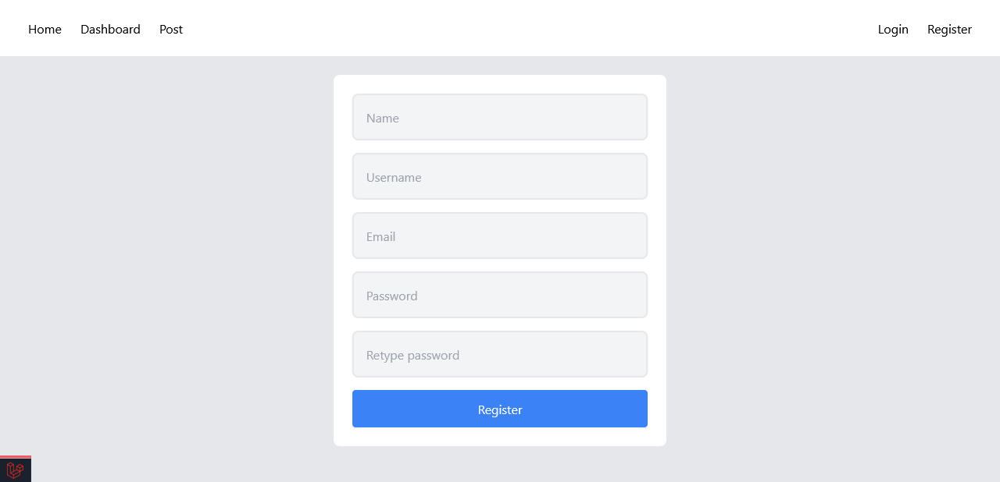
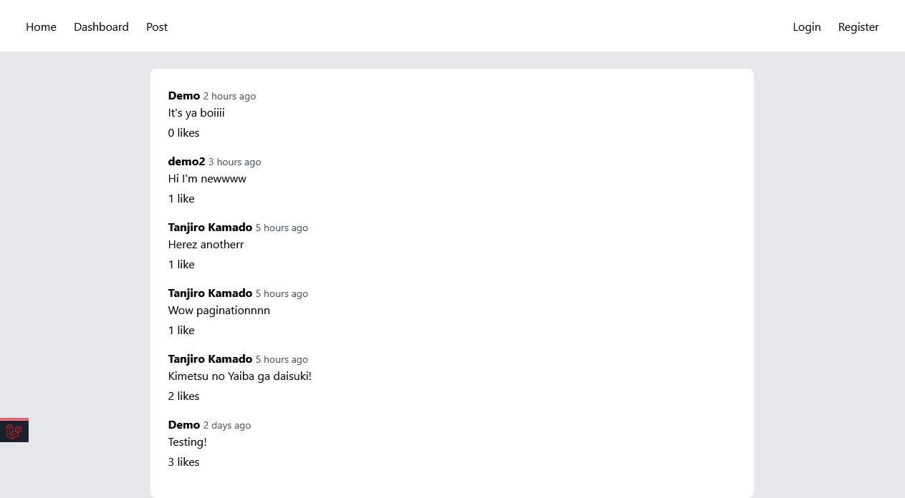
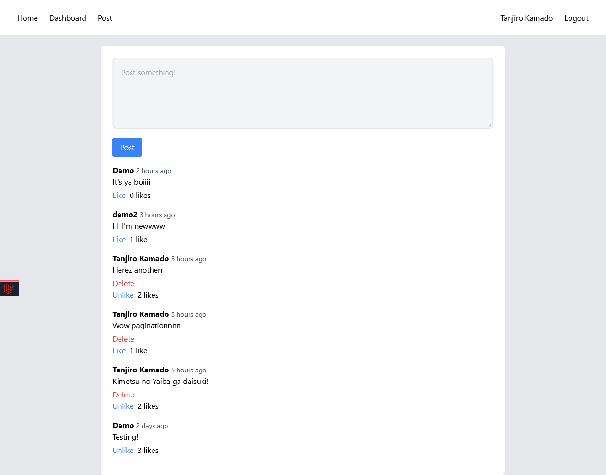
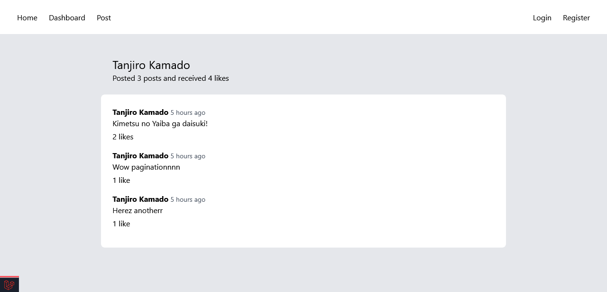
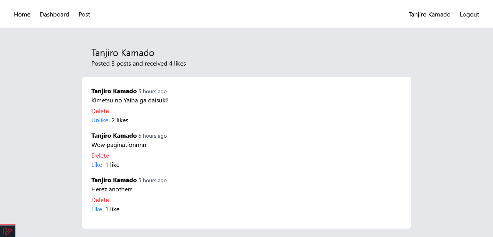

# Posty
*Laravel tutorial from [Codecourse](https://www.youtube.com/watch?v=MFh0Fd7BsjE)*

## Tutorial Concepts
This tutorial consists of a number of Laravel concepts, such as
- user login and registration
- user authentication
- implementing and using tailwind css
- blade templates and components
- sending email
- Artisan console
- migrations
- model relationships
- seeding and factory usage

## Some images of the finished tutorial

Login page

Registration page

Posts page as a guest

Posts page as a logged in user

Profile page as a guest

Profile page as a logged in user